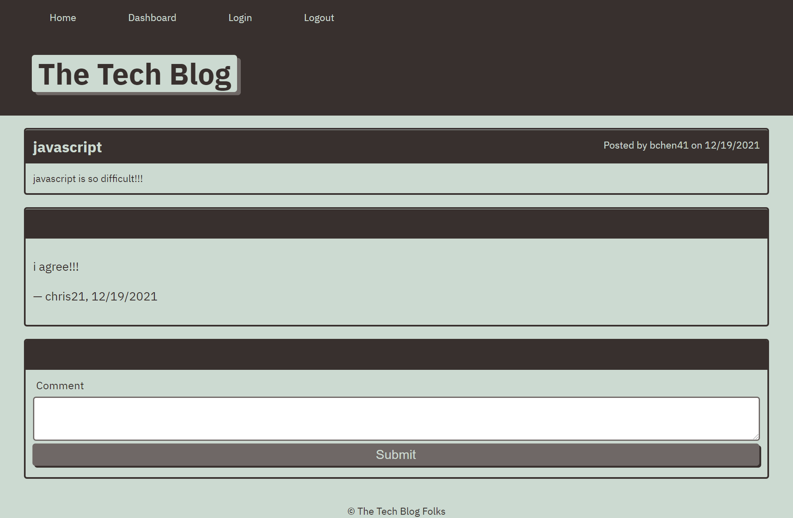

# MVC-Tech-Blog

 

- [Description](#description)
- [Installations](#installations)
- [Screenshot](#screenshot)
- [Lincense](#license)
- [Contributing](#contributing)
- [Questions](#questions)

## Description

This project allows developers to create an account to publish articles, blog posts, their thoughts and opinions on a tech blog website.

## Installations

npm install

## Screenshot

## Heroku Link

[Heroku](https://easy-tech-blog.herokuapp.com/)

## License

 
Copyright © 2021 [Betty Chen](https://github.com/bchen41).  
This project is [MIT](https://github.com/bchen41/MVC-Tech-Blog/blob/main/LICENSE) licensed.

## Contributing

All are welcomed to contribute as long as the standard industry guidelines are being followed.
Click [here](https://www.contributor-covenant.org/) for industry standard guidelines.

## Questions

For additional questions, contact me by reaching me at my [email](mailto:bettychen41@outlook.com).

You can find my other projects at my [GitHub](https://github.com/bchen41) profile.

Author: Betty Chen
